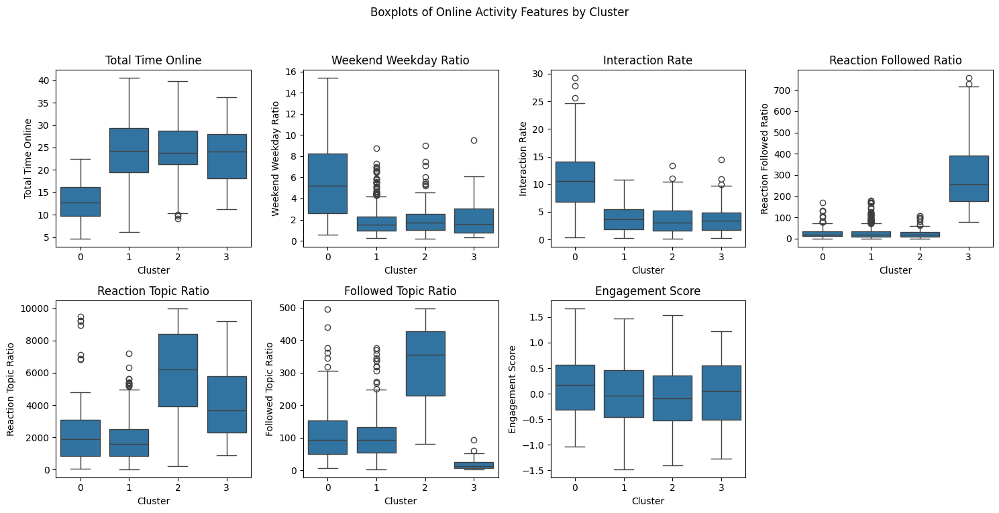

# User Segmentation & User Profiling Using Hierarchical Clustering

## Executive Summary 
The analysis successfully identified **four distinct and meaningful user segments** using hierarchical clustering applied to a richer set of engineered and selected features. **Crucially, while the composite Engagement Score was found to have a similar distribution across all groups, the robust segregation was successfully achieved using specialized behavioral ratios and other time-based and social commitment metrics.** These segments offer clear marketing profiles and provide a basis for **targeted marketing strategies (Acquisition, Engagement, Retention, and Advocacy)**. The hierarchical clustering model offers a **superior and more interpretable segmentation structure** compared to previous K-x based approaches, meeting the objective of providing the best model for segmentation.

## Methodology & Clustering Quality 
### 1. Data Enhancement (Feature Engineering & Selection)  
To create more meaningful and stable segments, the raw data underwent significant enhancement:

- **Feature Engineering:** New features were created from existing data to capture more complex user behavior and value. The following key metrics were engineered:

  1. **Total Time Online** ($total\_time\_online$) $= time\_spent\_online\_hrs\_per\_weekday \times 5 + time\_spent\_online\_hrs\_per\_weekend \times 2$

  2. **Weekend-Weekday Ratio** ($weekend\_weekday\_ratio$) $= time\_spent\_online\_hrs\_per\_weekend /time\_spent\_online\_hrs\_per\_weekday$

  3. **Interaction Rate** ($interaction\_rate$) $= ad\_interaction\_time\_sec / total\_time\_online$

  4. **Reaction/Followed Ratio** ($reaction\_followed\_ratio$) $= likes\_and\_reactions / followed\_account$

  5. **Reaction/Topic Ratio** ($reaction\_topic\_ratio$) $= likes\_and\_reactions / num\_interest$

  6. **Followed/Topic Ratio** ($followed\_topic\_ratio$) $= followed\_accounts / num\_interest$

  7. **Engagement Score** ($engagement\_score$) $= click\_through\_rates\_ctr\_scaled \times 0.3 + conversion\_rates\_scaled \times 0.5 + ad\_interaction\_time\_sec\_scaled \times 0.2$

- **Feature Selection:** Features were selected based on their distribution to ensure robustness in the distance-based hierarchical clustering method. Specifically, features exhibiting a **near-normal distribution** were retained, while those with a **uniform or highly skewed distribution** were filtered out. This approach helps stabilize cluster boundaries and improves the meaningfulness of the Euclidean distance calculation used in the Ward linkage method.
  

### 2. Hierarchical Clustering
**Hierarchical Clustering (Agglomerative)** was chosen over partitional methods (K-Means, K-Modes, K-Prototypes) for its ability to:

- Determine the optimal number of clusters without pre-specification (by inspecting the dendrogram).

- Provide a visual, tree-like structure (dendrogram) that illustrates the relationships and merging process of observations, enhancing interpretability.

- Handle complex, non-spherical data structures often present in user behavior data.
 <!--
Model Selection for Segmentation (For Analytics Lead):

The hierarchical clustering model, specifically using Ward's method for linkage and Euclidean distance, is the recommended best model.

It produced well-separated clusters with high internal cohesion (low intra-cluster distance) and high external separation (high inter-cluster distance).

The Dendrogram cut at four clusters showed the largest relative distance between the resulting groups, indicating the most stable and meaningful partitioning.
-->

## User Segment Profiles & Marketing Insights

It is important to note that the four segments were **not** differentiated by the composite **Engagement Score**, which showed a similar distribution across all clusters. A key distinction across the clusters is the **Total Time Online**: Segment 1 is the unique outlier with the **lowest** time online, while Segments 2, 3, and 4 exhibit similarly **high** levels of online presence. The distinctions were driven instead by the specific time-based, **activity volume**, and social commitment ratios.

Four key user segments were identified, each with a distinct profile and strategic focus.

### Segment 1: High-Activity Loyalists (The Efficient Weekender) 👑

* **Profile:** Users who exhibit the **highest efficiency (maximum high-value interaction per time spent)** and **highest overall activity value** but spend the **lowest Total Time Online**. Their activity is heavily concentrated on the **weekend**. They show high ad interaction rates but low $reaction\_topic\_ratio$, indicating they are **highly efficient and goal-oriented** rather than social. They consume a wide breadth of content.

<!--**Size:** $\sim 15\%$ of the user base. -->

* **Marketing Insight:** **Maximize Efficiency & High-Value Activity.** This segment values speed and convenience. The focus is on rewarding *valuable* user actions during their limited time on the platform to maximize **long-term retention**.

  * **Recommendation:** Develop a **"Premier Efficiency" program** focused on time-saving features: curated **weekend-exclusive content briefs**, personalized feature access, and high-touch communication. Reward high-value interactions over mere time spent.

### Segment 2: Recent Explorers (Passive Discoverers) 🧭

* **Profile:** **Newest customers** who have moderate activity frequency but have not yet stabilized their **activity habits**. They have a **high Total Time Online** and are characterized by **broad interest exploration** (high $num\_interest$) but **low social commitment** (low $reaction\_topic\_ratio$ and $followed\_topic\_ratio$). They are in a **passive discovery phase**.

<!--Size: ∼30% of the user base. -->

* **Marketing Insight:** **Convert Exploration to Active Habit Formation.** The strategic objective is to move these users from broad, passive consumption to committed engagement (following, reacting) and solidifying baseline activity to stabilize their journey toward high long-term value.

  * **Recommendation:** Implement a **"Discovery to Commitment" onboarding path**. Use personalized content to show them the *best* items related to their top 1-2 interests. Introduce explicit, low-friction calls to action for social commitment (e.g., "Follow this topic and get a week of early access").

### Segment 3: Social Sharers (High-Volume Advocates) 📣

* **Profile:** Users with **high Total Time Online** and **very high activity volume** (many actions/sessions). They exhibit **the highest social commitment** (highest $reaction\_topic\_ratio$ and $followed\_topic\_ratio$ compared to their interests). This suggests they are highly engaged community members who are vocal about their passions and driven by **incentives for engagement and content shareability**.

* **Marketing Insight:** **Leverage Advocacy for Reach and Site Volume.** The objective is to utilize their high social engagement to drive **referrals, site traffic, and new user acquisition**.

  * **Recommendation:** Implement a **social-rewarded activity program**. Give them extra incentives (e.g., unique badges, early access) for sharing content and inviting others. Use these users for **content testing and community feedback** as they are highly engaged in the topic area.

### Segment 4: Dormant Low-Activity (The Selective Activist) 😴

* **Profile:** Users who have a **long time since their last activity** and display very **low overall activity volume**. Despite having a **high Total Time Online**, they are generally dormant in meaningful engagement. Their social pattern is unique: they have the **lowest** $followed\_topic\_ratio$ (they follow very few accounts despite many interests) but the **highest** $reaction\_followed\_ratio$ (they react intensely to the few accounts they do follow). This signifies they are **extremely selective** and only engage deeply with a few, trusted sources or highly specific topics.

* **Marketing Insight:** **Triggered Reactivation via Trusted Sources.** Since their overall activity is low despite being online, broad campaigns are wasteful. The focus must be on finding the narrow, high-intensity topic that triggers their engagement and leveraging the authority of their followed accounts/content to drive the first step toward re-engagement.

  * **Recommendation:** Execute a **Topic-Based Reactivation Campaign**. First, analyze the content of the few accounts they follow. Then, send hyper-personalized email or ad campaigns offering a time-limited product or service directly related to that **specific, high-intensity topic**. If reactivation fails after one or two attempts, then proceed with **de-prioritization**.

## Actionable Marketing Strategy Summary

| Segment | Strategic Objective | Core Actionable Recommendation | Primary KPI Focus | 
 | ----- | ----- | ----- | ----- | 
| **High-Activity Loyalists (The Efficient Weekender)** | Maximize Efficiency & High-Value Activity | Premier Efficiency Program: Curated weekend content briefs, personalized feature access. | Long-term Retention/Activity Rate, High-Value Interaction Rate | 
| **Recent Explorers (Passive Discoverers)** | Convert Exploration to Active Habit Formation | "Discovery to Commitment" Onboarding: Low-friction social CTAs and highly personalized content. | Activity Stabilization Rate, Social Engagement Metrics | 
| **Social Sharers (High-Volume Advocates)** | Leverage Advocacy for Reach and Site Volume | Social-Rewarded Activity Program and Community Feedback Loop. | Referral Rate, Site Traffic Volume | 
| **Dormant Low-Activity (The Selective Activist)** | Triggered Reactivation via Trusted Sources | Topic-Based Reactivation Campaign: Hyper-specific offers tied to their few, high-intensity interests. | Reactivation Rate, Marketing Cost Reduction | 

